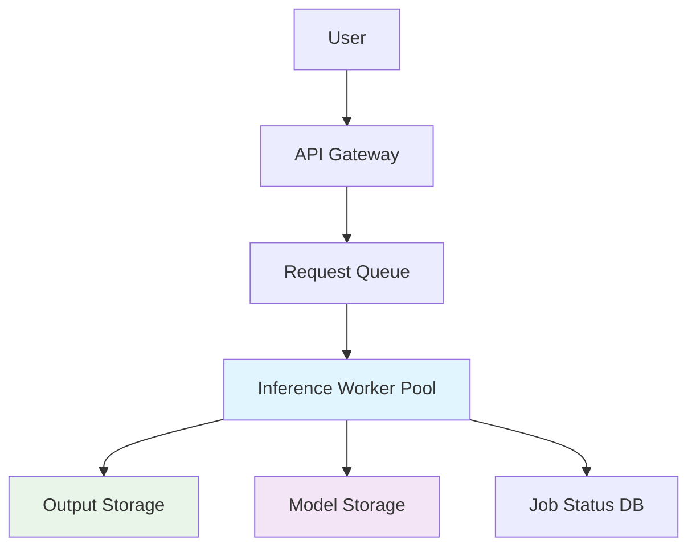

# LatentSync: Production Deployment Plan

**Document Version:** 1.0  
**Date:** July 13, 2025  

## 1. Executive Summary

This document outlines the technical strategy for deploying the LatentSync video generation pipeline into a scalable, reliable, and cost-effective production environment. The plan addresses critical considerations including infrastructure design, performance optimization, hardware requirements, fault tolerance, and monitoring.

The core objective is to transition the system from research and development to a robust service capable of handling significant concurrent video generation requests while maintaining predictable performance and quality. Based on our performance profiling, the optimized pipeline (Test 3B) serves as the foundation for this deployment, achieving **~1.8x speedup** and **64% memory reduction** compared to the baseline.

## 2. System Architecture & Infrastructure

### 2.1 Core Components

The production system will be architected as a decoupled, asynchronous service to maximize scalability and resilience.

| Component | Description | Technology Recommendation |
|-----------|-------------|---------------------------|
| **API Gateway** | Public-facing entry point handling authentication, request validation, and rate limiting | AWS API Gateway / Google Cloud Endpoints |
| **Request Queue** | Message queue to decouple API from processing workers, smoothing traffic spikes and enabling retries | AWS SQS / RabbitMQ / Google Cloud Pub/Sub |
| **Inference Workers** | GPU-accelerated compute instances executing the LatentSync pipeline | GPU-enabled Kubernetes Cluster (EKS/GKE) / AWS SageMaker Endpoints |
| **Model Storage** | Centralized storage for model checkpoints (UNet, VAE, SyncNet, Whisper) and assets | AWS S3 / Google Cloud Storage |
| **Output Storage** | Durable object store for generated video files | AWS S3 / Google Cloud Storage |
| **Cache/Database** | Redis/database instance for job status, metadata, and results | AWS ElastiCache for Redis / Google Memorystore |

### 2.2 High-Level Architecture

**Flow Description:**
1. Users submit requests through API Gateway
2. Validated requests are queued for processing
3. Available GPU workers pull jobs from queue
4. Workers load models from storage and process videos
5. Results are stored and status updated for user retrieval

## 3. Performance & Hardware Considerations

### 3.1 Latency Requirements & Throughput

**Target Latency:** Video generation (10 seconds / ~250 frames) completed within **3-5 minutes** from submission to completion. This positions the service as an "offline" asynchronous generation tool with user notifications via email/webhook upon completion.

**Throughput:** Horizontal scaling via containerized worker pools (Kubernetes) with automatic scaling based on queue length, ensuring consistent processing times under heavy load.

### 3.2 Memory Constraints & Hardware Selection

Our profiling results are critical for hardware selection:

| Configuration | Memory Requirement | Hardware Impact |
|---------------|-------------------|-----------------|
| **Baseline (Unoptimized)** | 11.24 GB VRAM | Requires expensive high-end GPUs (A100) |
| **Optimized (Test 3B)** | 4.02 GB VRAM | Enables cost-effective mid-tier GPUs |

**Hardware Recommendation:**
- **Primary Choice:** NVIDIA L4 Tensor Core GPU (24GB) or T4 Tensor Core GPU (16GB)
- **Cost-Effectiveness:** Significantly cheaper per hour than A100s
- **VRAM Sufficiency:** 4.02GB requirement fits comfortably with ample headroom
- **Compute Capability:** Tensor Cores fully leverage FP16 optimizations

**Worker Configuration:**
- Single T4/L4 GPU per worker
- 4-8 vCPU cores
- 32GB system RAM

## 4. Failure Modes & Mitigation Strategies

A robust production system must anticipate and handle failures gracefully:

| Failure Mode | Cause | Mitigation Strategy |
|--------------|-------|-------------------|
| **GPU Worker Crash** | CUDA OOM, driver issues, hardware failure | **Health Checks & Auto-Healing:** Kubernetes performs regular health checks. Failed workers are automatically terminated and replaced. Jobs are re-queued. |
| **Invalid User Input** | Corrupt video, unsupported format, no detectable face | **Input Validation:** API Gateway performs rigorous validation. Invalid jobs rejected immediately with clear error messages (400 Bad Request). |
| **Model Loading Failure** | Corrupt checkpoint, network issues | **Startup Probes & Retries:** Workers verify model loading before marking "Ready". Exponential backoff retry for asset downloads. |
| **Downstream Service Failure** | Storage or database unavailable | **Dead-Letter Queue (DLQ):** Failed jobs moved to DLQ after retries. Manual inspection prevents infinite blocking. |
| **"Poison Pill" Job** | Specific input consistently crashes workers | **DLQ + Alerting:** DLQ size alerts notify engineers of potential poison pills requiring offline analysis. |

## 5. Monitoring & Alerting

Continuous monitoring is essential for maintaining service health and performance.

### 5.1 Infrastructure Monitoring

**Metrics Tracked:**
- GPU Utilization (%)
- GPU Memory Usage (GB)
- CPU Utilization (%)
- Pod Restart Rate

**Tools:** Prometheus + Kubernetes, AWS CloudWatch Agent

**Critical Alerts:**
- Sustained GPU utilization below threshold (idle/stuck workers)
- High pod restart rate (persistent crash loops)

### 5.2 Application Performance Monitoring (APM)

**Metrics Tracked:**
- End-to-end job processing time
- LSE-D and PSNR/SSIM scores per job
- Job success/failure rates

**Tools:** Datadog, Splunk, or ELK Stack with custom logging

**Critical Alerts:**
- Average job processing time exceeds 5-minute SLA
- Job failure rate exceeds 5% over 15-minute window
- Significant increase in average LSE-D score (model degradation)

### 5.3 Queue Monitoring

**Metrics Tracked:**
- Queue depth (number of pending messages)
- Dead-letter queue size

**Tools:** Native AWS SQS CloudWatch metrics

**Auto-Scaling Triggers:**
- Add workers when queue depth surpasses threshold
- High-priority alert if DLQ size > 0

## 6. Deployment Strategy

### 6.1 Initial Rollout

1. **Phase 1:** Deploy single-worker proof-of-concept with basic monitoring
2. **Phase 2:** Implement auto-scaling with 3-5 workers and comprehensive alerting
3. **Phase 3:** Production rollout with full redundancy and disaster recovery

### 6.2 Scaling Considerations

**Horizontal Scaling:**
- Workers scale based on queue depth
- Maximum workers limited by GPU budget
- Minimum workers maintained for responsiveness

**Cost Optimization:**
- Use spot instances for non-critical workers
- Implement job priority queues
- Schedule maintenance during low-traffic periods

## 7. Success Metrics

| Metric | Target | Measurement |
|--------|--------|-------------|
| **Availability** | 99.9% uptime | Service health monitoring |
| **Latency** | 95% of jobs < 5 minutes | End-to-end processing time |
| **Quality** | LSE-D score consistency ±5% | Per-job quality metrics |
| **Cost Efficiency** | <$0.50 per generated video | Resource utilization tracking |

## 8. Risk Assessment

**High Risk:**
- GPU hardware availability during peak demand
- Model checkpoint corruption or unavailability

**Medium Risk:**
- Network latency affecting user experience
- Unexpected scaling costs

**Low Risk:**
- Minor quality degradation during high load
- Individual worker failures (mitigated by redundancy)

This deployment plan provides a robust foundation for scaling LatentSync while maintaining quality, performance, and cost-effectiveness in production environments.