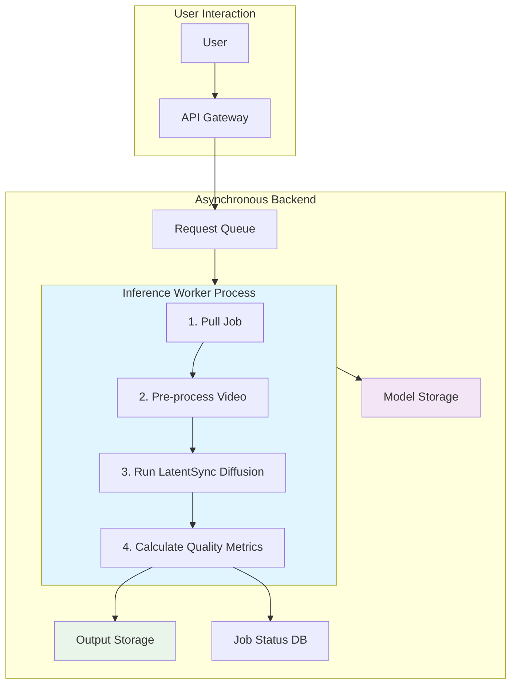

# LatentSync: Production Deployment Plan

**Document Version:** 1.0  
**Date:** July 14, 2025  


## 1. Executive Summary

This document outlines the technical strategy for deploying the LatentSync video generation pipeline into a scalable, reliable, and cost-effective production environment. The plan addresses critical considerations including infrastructure design, performance optimization, hardware requirements, fault tolerance, and monitoring.

The core objective is to transition the system from research and development to a robust service capable of handling significant concurrent video generation requests while maintaining predictable performance and quality. Based on our performance profiling, the optimized pipeline (Test 2B) serves as the foundation for this deployment, achieving **~1.8x speedup** and **64% memory reduction** compared to the baseline.

## 2. System Architecture & Infrastructure

### 2.1 Core Components

The production system will be architected as a decoupled, asynchronous service to maximize scalability and resilience.

| Component | Description | Technology Recommendation |
|-----------|-------------|---------------------------|
| **API Gateway** | Public-facing entry point handling authentication, request validation, and rate limiting | AWS API Gateway / Google Cloud Endpoints |
| **Request Queue** | Message queue to decouple API from processing workers, smoothing traffic spikes and enabling retries | AWS SQS / RabbitMQ / Google Cloud Pub/Sub |
| **Inference Workers** | GPU-accelerated compute instances executing the LatentSync pipeline | GPU-enabled Kubernetes Cluster (EKS/GKE) / AWS SageMaker Endpoints |
| **Model Storage** | Centralized storage for model checkpoints (UNet, VAE, SyncNet, Whisper) and assets, model artifacts will be bundled and versioned together as a single logical unit | AWS S3 / Google Cloud Storage |
| **Output Storage** | Durable object store for generated video files | AWS S3 / Google Cloud Storage |
| **Cache/Database** | Redis/database instance for job status, metadata, and results | AWS ElastiCache for Redis / Google Memorystore |

### 2.2 High-Level Architecture



**Flow Description:**
1. Users submit requests through API Gateway
2. Validated requests are queued for processing
3. Available GPU workers pull jobs from queue
4. Workers load models from storage and process videos
5. Results are stored and status updated for user retrieval

## 3. Performance & Hardware Considerations

### 3.1 Latency Requirements & Throughput

**Target Latency:** Video generation (10 seconds / ~250 frames) completed within **3-5 minutes** from submission to completion. This positions the service as an "offline" asynchronous generation tool with user notifications via email/webhook upon completion.

**Throughput:** Horizontal scaling via containerized worker pools (Kubernetes) with automatic scaling based on queue length, ensuring consistent processing times under heavy load.

### 3.2 Memory Constraints & Hardware Selection

Our profiling results are critical for hardware selection:

| Configuration | Memory Requirement | Hardware Impact |
|---------------|-------------------|-----------------|
| **Baseline (Unoptimized)** | 11.24 GB VRAM | Requires expensive high-end GPUs (A100) |
| **Optimized (Test 2B)** | 4.02 GB VRAM | Enables cost-effective mid-tier GPUs |

**Hardware Recommendation:**
- **Primary Choice:** NVIDIA L4 Tensor Core GPU (24GB) or T4 Tensor Core GPU (16GB)
- **Cost-Effectiveness:** Significantly cheaper per hour than A100s
- **VRAM Sufficiency:** 4.02GB requirement fits comfortably with ample headroom
- **Compute Capability:** Tensor Cores fully leverage FP16 optimizations

**Worker Configuration:**
- Single T4/L4 GPU per worker
- 4-8 vCPU cores
- 32GB system RAM

## 4. Failure Modes & Mitigation Strategies

A robust production system must anticipate and handle failures gracefully:

| Failure Mode | Cause | Mitigation Strategy |
|--------------|-------|-------------------|
| **GPU Worker Crash** | CUDA OOM, driver issues, hardware failure | **Health Checks & Auto-Healing:** Kubernetes performs regular health checks. Failed workers are automatically terminated and replaced. Jobs are re-queued. |
| **Invalid User Input** | Corrupt video, unsupported format, no detectable face | **Input Validation:** API Gateway performs rigorous validation. Invalid jobs rejected immediately with clear error messages (400 Bad Request). |
| **Pre-processing Failure** | Face detection fails; video frames are corrupt or have unusual angles | Implement a robust recovery and rejection policy. For transient failures (e.g., face not detected for a few frames), use the last known-good face position to continue processing. If the failure is critical (e.g., no face detected in the first 50 frames), reject the job and move it to the DLQ with a specific error code. |
| **Model Loading Failure** | Corrupt checkpoint, network issues | **Startup Probes & Retries:** Workers verify model loading before marking "Ready". Exponential backoff retry for asset downloads. |
| **Downstream Service Failure** | Storage or database unavailable | **Dead-Letter Queue (DLQ):** Failed jobs moved to DLQ after retries. Manual inspection prevents infinite blocking. |
| **"Poison Pill" Job** | Specific input consistently crashes workers | **DLQ + Alerting:** DLQ size alerts notify engineers of potential poison pills requiring offline analysis. |


## 5. Monitoring & Alerting

Continuous monitoring is essential for maintaining service health and performance.

### 5.1 Infrastructure Monitoring (Node/Pod Level)

**Metrics Tracked:**
- GPU Utilization (%)
- GPU Memory Usage (GB)  
- CPU Utilization (%)
- Pod Restart Rate

**Tools:** Prometheus integrated with Kubernetes cluster, AWS CloudWatch Agent

**Critical Alerts (PagerDuty/Opsgenie):**
- Sustained GPU utilization below threshold (indicates idle/stuck workers)
- High rate of pod restarts (indicates persistent crash loop)

### 5.2 Application Performance Monitoring (APM)

**Metrics Tracked:**
- End-to-end job processing time (from queue to completion)
- Sync_conf, FVD, and FID/SSIM scores per job (in line with paper)
- Job success/failure rates

**Tools:** Custom logging to centralized services like Datadog, Splunk, or ELK Stack. Log key metrics at each stage of the pipeline (01|init-components, 04|run-pipeline, etc.)

**Critical Alerts:**
- Alert if average job processing time exceeds 5-minute SLA
- Alert if job failure rate exceeds defined threshold (e.g., 5% over 15-minute window)
- Alert on significant decrease in average Sync_conf score or increase in FVD (could indicate a 'bad' model deployment or a problem with the pipeline)

### 5.3 Queue Monitoring

**Metrics Tracked:**
- Number of messages in queue (Queue Depth)
- Dead-letter queue size

**Tools:** Native AWS SQS CloudWatch metrics

**Auto-Scaling Triggers:**
- Trigger auto-scaling event to add more workers when queue depth surpasses threshold
- Trigger high-priority alert if DLQ size is greater than zero

## 6. Security Considerations

### 6.1 Access Control & Authentication

**Identity and Access Management (IAM):**
- **S3 Bucket Access:** Use IAM roles with least-privilege principles for model storage and output storage access
- **Service-to-Service Authentication:** Implement service accounts with role-based access control (RBAC) in Kubernetes
- **API Gateway Security:** Enforce API key authentication, rate limiting, and request signing

**Network Security:**
- **VPC Isolation:** Deploy all infrastructure within private VPCs with controlled ingress/egress rules
- **Security Groups:** Configure restrictive security groups allowing only necessary traffic between components
- **Private Endpoints:** Use VPC endpoints for S3 access to avoid internet routing

### 6.2 Input Validation & Data Protection

**Input Sanitization:**
- **File Type Validation:** Strict whitelist of allowed video/audio formats and codecs
- **Content Scanning:** Implement virus scanning and malware detection on uploaded files
- **Size Limits:** Enforce maximum file size and duration limits to prevent resource exhaustion

**Data Protection:**
- **Encryption in Transit:** TLS 1.3 for all API communications and internal service communication
- **Encryption at Rest:** Enable S3 server-side encryption (SSE-S3 or SSE-KMS) for all stored data
- **Data Retention:** Implement automated cleanup policies for temporary files and user uploads

### 6.3 Container Security

**Image Security:**
- **Base Image Scanning:** Use minimal, security-hardened base images (e.g., distroless)
- **Vulnerability Scanning:** Integrate container image scanning in CI/CD pipeline
- **Runtime Security:** Implement Pod Security Standards and network policies in Kubernetes

## 7. Deployment Strategy

### 7.1 CI/CD Pipeline

**Continuous Integration:**
```yaml
# Example GitHub Actions workflow
name: LatentSync CI/CD
on:
  push:
    branches: [main, develop]
  pull_request:
    branches: [main]

jobs:
  build-and-test:
    runs-on: ubuntu-latest
    steps:
      - uses: actions/checkout@v3
      - name: Build Docker Image
        run: docker build -t latentsync:${{ github.sha }} .
      - name: Security Scan
        run: docker scan latentsync:${{ github.sha }}
      - name: Run Unit Tests
              run: docker run --rm latentsync:${{ github.sha }} pytest
            - name: Run Model Smoke Test
              run: |
                docker run --gpu=1 --rm latentsync:${{ github.sha }} \
                python tools/run_smoke_test.py --expected_sync_conf 8.5 --expected_fvd 200

        
```

**Continuous Deployment:**
- **Staging Environment:** Automated deployment to staging cluster for integration testing
- **Blue-Green Deployment:** Zero-downtime production deployments using blue-green strategy
- **Rollback Capability:** Automated rollback mechanisms if health checks fail
- **Infrastructure as Code:** Use Terraform or AWS CDK for reproducible infrastructure provisioning

**Container Registry:**
- **Private Registry:** Use AWS ECR or Google Container Registry for secure image storage
- **Image Signing:** Implement container image signing for supply chain security
- **Multi-Stage Builds:** Optimize container images for production (separate build and runtime stages)

### 7.2 Initial Rollout

1. **Phase 1:** Deploy single-worker proof-of-concept with basic monitoring
2. **Phase 2:** Implement auto-scaling with 3-5 workers and comprehensive alerting
3. **Phase 3:** Production rollout with full redundancy and disaster recovery

### 7.2 Scaling Considerations

**Horizontal Scaling:**
- Workers scale based on queue depth
- Maximum workers limited by GPU budget
- Minimum workers maintained for responsiveness

**Cost Optimization:**
- Use spot instances for non-critical workers
- Implement job priority queues
- Schedule maintenance during low-traffic periods

## 8. Success Metrics

| Metric | Target | Measurement |
|--------|--------|-------------|
| **Availability** | 99.9% uptime | Service health monitoring |
| **Latency** | 95% of jobs < 5 minutes | End-to-end processing time |
| **Quality** | Avg. Sync_conf score > 8.5<br>Avg. FVD score < 200 | Per-job quality metrics |
| **Cost Efficiency** | <$0.50 per generated video | Resource utilization tracking |

## 9. Risk Assessment

**High Risk:**
- GPU hardware availability during peak demand
- Model checkpoint corruption or unavailability

**Medium Risk:**
- Network latency affecting user experience
- Unexpected scaling costs

**Low Risk:**
- Minor quality degradation during high load
- Individual worker failures (mitigated by redundancy)

This deployment plan provides a robust foundation for scaling LatentSync while maintaining quality, performance, and cost-effectiveness in production environments.